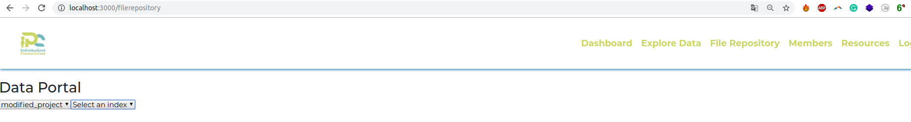

The purpose of this repository is to provide users with a local and isolated sandbox to play with some of Overture's genomic services, such as Song, Score, Ego, Maestro and Arranger. 
Every release contains a stable and tested configuration of various Overture products using absolute versions, so that specific configurations can be reproduced. 
The services are managed by `docker-compose` and are bootstrapped with fixed data so that users can start playing around as fast as possible.

##  <a name="toc"></a> Table of Contents
* [Software Requirements](#software-requirements)
* [Quick Start](#quick-start)
* [Software Installation for x86_64](#software-installation-for-x86_64)
   * [Ubuntu 18.04 or Higher](#ubuntu-18.04-or-higher)
      * [Docker](#ubuntu-docker)
      * [Docker Compose](#ubuntu-docker-compose)
      * [GNU Make](#ubuntu-gnu-make)
   * [OSX](#osx)
      * [Docker](#osx-docker)
      * [Docker Compose](#osx-docker-compose)
      * [Homebrew](#homebrew)
      * [GNU Make](#osx-gnu-make)
* [Storage Architecture](#storage-architecture)
* [Indexing Architecture](#indexing-architecture)
* [Portal Architecture](#portal-architecture)
* [Bootstrapped Configurations](#bootstrapped-configurations)
   * [Docker host and container path mappings](#docker-host-and-container-path-mappings)
   * [Ego](#ego)
   * [Score](#score)
   * [Song](#song)
   * [Object Storage](#object-storage)
   * [Zookeeper](#zookeeper)
   * [ElasticSearch](#elasticsearch)
   * [Kibana](#kibana)
   * [Kafka Broker](#kafka)
   * [Kafka Rest Proxy](#rest)
   * [Maestro](#maestro)
   * [Arranger](#arranger)
* [Usage](#usage)
   * [Environment Setup](#environment-setup)
      * [Starting All Services and Initializing Data](#starting-all-services-and-initializing-data)
      * [Destroying All Services and Data](#destroying-all-services-and-data)
   * [Service Interaction Examples](#service-interaction-examples)
   	  * [Index the already published analysis and start indexing the upcoming ones](#index-analysis)
   	  * [Look for existent indices](#check-indices)
      * [Look for an index content](#index-content)
      * [Look for existent indices and file_centric content](#elastic-content)
      * [Submit a payload](#submit-a-payload)
      * [Generate a manifest](#generate-a-manifest)
      * [Upload the files](#upload-the-files)
      * [Publish the analysis](#publish-the-analysis)
      * [Download analysis files](#download-analysis-files)
   * [Perform all the process at once](#all-in-one)
* [License](#license)

<!-- Added by: rtisma, at: Wed Dec  4 09:34:59 EST 2019 -->

<!--te-->

## <a name="software-requirements"></a> Software Requirements
- docker engine version >= **18.06.0**
- docker-compose version >= **1.22.0**
- compose file format version >= **3.7**
- Bash Shell
- GNU Make

## <a name="quick-start"></a>Quick Start
Assuming docker, docker-compose and make are already installed, you can just jump straight to the [usage sections](#usage)

[Back to Contents](#toc)

## <a name="software-installation-for-x86_64"></a>Software Installation for x86_64
### <a name="ubuntu-18.04-or-higher"></a>Ubuntu 18.04 or Higher
#### <a name="ubuntu-docker"></a> Docker
```bash
sudo apt update
sudo apt remove docker docker-engine docker.io
sudo apt install -y apt-transport-https ca-certificates curl software-properties-common
curl -fsSL https://download.docker.com/linux/ubuntu/gpg | sudo apt-key add -
sudo add-apt-repository  "deb [arch=amd64] https://download.docker.com/linux/ubuntu $(lsb_release -cs) stable"
sudo apt-get update
sudo apt-get install -y docker-ce
sudo usermod -aG docker <your_user_name>

# Logout and log back in

# Test with
docker ps
```

[Back to Contents](#toc)

#### <a name="ubuntu-docker-compose"></a> Docker Compose
```bash
# You can replace 1.25.0 with any version
sudo curl -L "https://github.com/docker/compose/releases/download/1.25.0/docker-compose-$(uname -s)-$(uname -m)" -o /usr/local/bin/docker-compose
sudo chmod +x /usr/local/bin/docker-compose
sudo ln -s /usr/local/bin/docker-compose /usr/bin/docker-compose

# Test with
docker-compose --version
```

[Back to Contents](#toc)

#### <a name="ubuntu-gnu-make"></a> GNU Make
```bash
sudo apt update 
sudo apt install -y make
```

[Back to Contents](#toc)

### <a name="osx"></a> OSX

#### <a name="osx-docker"></a> Docker
Refer to the instructions for [Installing Docker Desktop on Mac](https://docs.docker.com/docker-for-mac/install/)

#### <a name="osx-docker-compose"></a> Docker Compose
Already included in Docker Desktop on Mac

#### <a name="homebrew"></a>Homebrew
Needed in order to install GNU Make
```bash
/usr/bin/ruby -e "$(curl -fsSL https://raw.githubusercontent.com/Homebrew/install/master/install)"
```

#### <a name="osx-gnu-make"></a> GNU Make
```bash
brew install coreutils make
```

[Back to Contents](#toc)

## <a name="storage-architecture"></a>Storage Architecture
There are 3 core Overture services used to manage genomic data: [Song](https://www.overture.bio/products/song) for genomic metadata, [Ego](https://www.overture.bio/products/ego) for security, and [Score](https://www.overture.bio/products/score) for genomic object data. 

For Score the back-end object storage service that was used was [Minio](https://min.io/). For Song and Ego, `postgreSQL` was used as the database technology.

For more information on these services, visit the [Song documentation](https://song-docs.readthedocs.io), [Ego documentation](https://ego.readthedocs.io) and [Score documentation](https://score-docs.readthedocs.io). 


[Back to Contents](#toc)

## <a name="indexing-architecture"></a>Indexing Architecture
TODO: create maestro architecture diagram

[Back to Contents](#toc)

## <a name="portal-architecture"></a>Portal Architecture
TODO: create arranger architecture diagram

[Back to Contents](#toc)

## <a name="bootstrapped-configurations"></a>Bootstrapped Configurations

[Back to Contents](#toc)

### <a name="docker-host-and-container-path-mappings"></a>Docker host and container path mappings
Since all clients and services communicate through a docker network, any files from the docker host that are to be used with the clients must be mounted into the docker containers. 
Similarly, any files that need to be output from the containers to the docker host must also be mounted. Since these files are not apart of this repository, they can be located in the `./scratch` directory.
This has already been pre-configured in the `docker-compose.yml`. 
The following represent the docker host path to docker container path mappings:

**NOTE:** All file paths below are relative to the root directory of this repository.

| Host path | Container path | Description |
| ----------| ---------------|-------------|
| ./song-example-data             | /song-client/input   | Contains example files for submitting to Song and uploading to Score. Used by the `song-client` and `score-client` |
| ./scratch/song-client-output    | /song-client/output  | Contains files generated by the `song-client`. Used by the `song-client` and `score-client`. |
| ./scratch/score-client-output   | /score-client/output | Contains files generated by the `score-client`. Used only by the `score-client`. |
| ./scratch/song-client-logs      | /song-client/logs    | Contains logs generated by the `song-client`. Used only by `song-client`. |
| ./scratch/score-client-logs     | /score-client/logs   | Contains logs generated by the `score-client`. Used only by `score-client`. |
| ./scratch/song-server-logs      | /song-server/logs    | Contains logs generated by the `song-server`. Used only by `song-server`. |
| ./scratch/score-server-logs     | /score-server/logs   | Contains logs generated by the `score-server`. Used only by `score-server`. |

The following configurations are initialized when the services are started. 


### <a name="ego"></a>Ego
- Swagger URL: http://localhost:9082/swagger-ui.html
- User Id: `c6608c3e-1181-4957-99c4-094493391096`
- User Email: `john.doe@example.com`
- User Name: `john.doe@example.com`
- JWT: `any_jwt` (**Note**: although security is disabled, the Authorization header field must be present with all requests and can have ANY value)
- Api Key: `f69b726d-d40f-4261-b105-1ec7e6bf04d5` (**Note**: this Api Key is the Access Token for both Song and Score)
- Api Key Scopes: `score.WRITE`, `song.WRITE`, `id.WRITE`
- Database
    - Host: `localhost`
    - Port: `9444`
    - Name: `ego`
    - Username: `postgres`
    - Password: `password`

### <a name="score"></a>Score
- Score-client Location: `./tools/score-client`
- Client Access Token: `f69b726d-d40f-4261-b105-1ec7e6bf04d5`

### <a name="song"></a>Song
- Swagger URL: http://localhost:8080/swagger-ui.html
- Song-client Location: `./tools/song-client`
- Client Access Token: `f69b726d-d40f-4261-b105-1ec7e6bf04d5`
- Default StudyId:  `ABC123`
- Database
    - Name: `song`
    - Username: `postgres`
    - Password: `password`

### <a name="object-storage"></a>Object Storage
- UI URL: http://localhost:8085
- Minio Client Id: `minio`
- Minio Client Secret: `minio123`

### <a name="zookeeper"></a>Zookeeper
- URL: http://localhost:2181

### <a name="elasticsearch"></a>ElasticSearch
- URL: http://localhost:9200

### <a name="kibana"></a>Kibana
- URL: http://localhost:5601

### <a name="kafka"></a>Kafka Broker
- URL: http://localhost:9092

### <a name="rest"></a>Kafka Rest Proxy
- URL: http://localhost:8082

### <a name="maestro"></a>Maestro
- URL: http://localhost:11235

### <a name="arranger"></a>Arranger
- Server URL: http://localhost:5050
- Admin UI URL: http://localhost:9080
    - Project Config Dir: `./arranger-data/project/file_centric/`
- Portal URL: http://localhost:3000

### <a name="check-indices"></a>Look for existent indices
```bash
curl -X GET "localhost:9200/_cat/indices"
```

### <a name="index-content"></a>Look for an index content
```bash
curl -X GET "localhost:9200/file_centric_1.0/_search?size=100"
```

[Back to Contents](#toc)

## <a name="usage"></a>Usage
The following sections describe Makefile targets and how they can be executed to achieve a specific goal. A list of all available targets can be found by running `make help`. Multiple targets can be run in a specific order from left to right.

[Back to Contents](#toc)

### <a name="environment-setup"></a>Environment Setup
These scenarios are related to starting and stopping the docker services.  In order to successfully run the following instructions, the following commands shoud be run in the root directory of the repository.

#### <a name="clone-repo"></a>Cloning the Repository
Firstly, clone this repo and ensure you are in the root directory:

```bash
git clone https://github.com/overture-stack/genomic-data-playground

# Switch to the root directory of the repo
cd genomic-data-playground
```

#### <a name="starting-all-services-and-initializing-data"></a>Starting All Services and Initializing Data

To start the song, score, and ego services and initialize their data, simply run the following command:

```bash
make start-storage-services
```

To start the elasticsearch, maestro, and arranger services, simply run the following command:

```bash
make start-maestro-services
```

To start the webpage, simply run the following command:

```bash
make start-website
```

To start the elasticsearch, maestro, and arranger services, the website and index the already existent files in song, simply run the following command:

```bash
make start-maestro-services-and-indexing
```

To execute all the previous steps, simply run the following command:
 ```bash
make start-all-services
 ```

#### <a name="destroying-all-services-and-data"></a>Destroying All Services and Data

To stop all services and delete their data, run:
```bash
make clean
```
This will delete all files and directories located in the `./scratch` directory, including logs and generated files.

### <a name="service-interaction-examples"></a>Service Interaction Examples

#### <a name="index-analysis"></a>Index the already published analysis

```bash
curl -X PUT "localhost:9200/file_centric" -H 'Content-Type: application/json' --data "/path/to/repository/song-example-data/file_centric_mapping.json"
curl -X POST http://localhost:11235/index/repository/local_song -H 'Content-Type: application/json' -H 'cache-control: no-cache'
```

or run the following command:

```bash
make create-elasticsearch-index
```

At this point, it is important to realize that the previous creation of the index is an optional step. Indeed, the user can only run the `curl -X POST http://localhost:11235/index/repository/local_song -H 'Content-Type: application/json' -H 'cache-control: no-cache'` and the index will be automatically created. Nevertheless, the types will be infered by ElasticSearch. In general, they are insered as `text` instead of `keyword`. This fact is incompatible with arranger, so the user is responsible to take care of the indices in ElasticSearch. In addition, it is no possible to change the type of indices that already contain some entries. Hence, this process must be done before inserting any entry.

#### <a name="check-indices"></a>Look for existent indices
```bash
curl -X GET "localhost:9200/_cat/indices"
```

#### <a name="index-content"></a>Look for an index content
```bash
curl -X GET "localhost:9200/file_centric/_search?size=100"
```

#### <a name="elastic-content"></a> Look for existent indices and file_centric content
It is possible to run the previous command by just running the following command:
```bash
make test-elasticsearch-content
```

#### <a name="submit-a-payload"></a>Submit a payload
Ping the Song server to see if its running
```bash
./tools/song-client ping
```

Submit the `exampleVariantCall.json` file located in the `/song-client/input` directory
```bash
./tools/song-client submit -f /song-client/input/exampleVariantCall.json
```

If successful, the output will contain the `analysisId` which will be needed in the following steps.

#### <a name="generate-a-manifest"></a>Generate a manifest
Using the `analysisId` from the previous [submit step](#submit-a-payload) execute the following command to generate a `manifest.txt` file.

```bash
./tools/song-client manifest -f /song-client/output/manifest.txt -d /song-client/input -a <analysisId>
```
The output `manifest.txt` file is used with the `score-client` to upload the files.

#### <a name="upload-the-files"></a>Upload the files
Using the `manifest.txt` from the previous [manifest generation step](#generate-a-manifest) execute the following command to upload files to the object storage

```bash
./tools/score-client upload --manifest /song-client/output/manifest.txt
```

#### <a name="publish-the-analysis"></a>Publish the analysis
Once the files of an analysis are uploaded, the analysis can be published using the `analysisId` returned from the [submit step](#submit-a-payload)
```bash
./tools/song-client publish -a <analysisId>
```

#### <a name="unpublish-the-analysis"></a>Publish the analysis
In order to overwrite files to score, the analysis must be unpublished. They can be unpublished using the `analysisId` used in the [publish step](#publish-the-analysis)
```bash
./tools/song-client unpublish -a <analysisId>
```

#### <a name="download-analysis-files"></a>Download analysis files

Before downloading a file, the `objectId` must be known. 
Using the following command, search Song for the analysis given the `analysisId`, and then
extract the `objectId` for the `example.vcf.gz` file.

```bash
./tools/song-client search -a <analysisId>
```

Using the extracted `objectId`, run the following command to download the file:

```bash
./tools/score-client download --object-id <objectId> --output-dir /score-client/output/download1
```
This will download the file to the specified directory. 
The file can be accessed on the docker host by referring to the [docker path mapping table](#docker-host-and-container-path-mappings)

### <a name="all-in-one"></a>Perform all the process at once
It is possible to launch all the workload explained in this section with a single command that initializes all the services and uploads two payloads into the system with the following command:
```bash
make test-workflow
```

[Back to Contents](#toc)

### <a name="arranger-conf"></a>Website configuration

To configure the fields that will be shown in the website, arranger must be configured. This can be done through the `localhost:9080` endpoint:

1. Click on `Add Project`

2. Enter the project name in the `Project ID` field.

3. Click on `Add Index`

4. Fill the fields `Name` with the Arranger alias for the elasticsearch index and `ES index` with the elasticsearch index.


5. Click on the project name

In this screen, there are 3 important tabs:

* Fields: it allows to rename the fields and specify their type

* Aggs Panel: it allows to select the information that will be available to do the filtering 

* Table: it allows to select the available fields that will be shown in the central table

At this stage, `arranger` cannot have fields of type `id` with this name. Hence, in this scenario, they have to be changed to `keyword`. In order to do so:

6. Filter the fields by `Type` equal to `id`.

7. In the top right corner, change the `Aggregation Type` from `id` to `keyword` to all fields that are named `id`. In this case, the concerned fields are:

* analysis.id
* donors.id
* donors.specimens.id
* donors.specimens.samples.id

8. Click on the `Aggs Panel` tab


9. Check the box `Shown` for those fields that you want to show in the aggregation panel. It is also possible to disable some parameters if you don't want them to be accessible from the website.

10. Click on tthe `Table` tab


11. Select the fields that will be shown by default in the table. In addition, you can disable the fields that you don't want to be accessible from there.

12. Click on `Save Project`, on the top right corner


At this point, the setup is finished. It is already possible to open `localhost:3000` in a web browser, go to the `File Repository` and select the project and index we have just created.



If you have already accessed this project previously, you may need to erase the cookies to select a project. In Chrome, this can be done by selecting the `i` icon next to the url, click on `Site settings`. Afterwards, click on the button `Clear data`. This way, you will keep all the other information stored by the navigator.

[Back to Contents](#toc)

## <a name="license"></a>License
Copyright (c) 2019. Ontario Institute for Cancer Research

This program is free software: you can redistribute it and/or modify
it under the terms of the GNU Affero General Public License as
published by the Free Software Foundation, either version 3 of the
License, or (at your option) any later version.

This program is distributed in the hope that it will be useful,
but WITHOUT ANY WARRANTY; without even the implied warranty of
MERCHANTABILITY or FITNESS FOR A PARTICULAR PURPOSE.  See the
GNU Affero General Public License for more details.

You should have received a copy of the GNU Affero General Public License
along with this program.  If not, see <https://www.gnu.org/licenses/>.

[Back to Contents](#toc)
